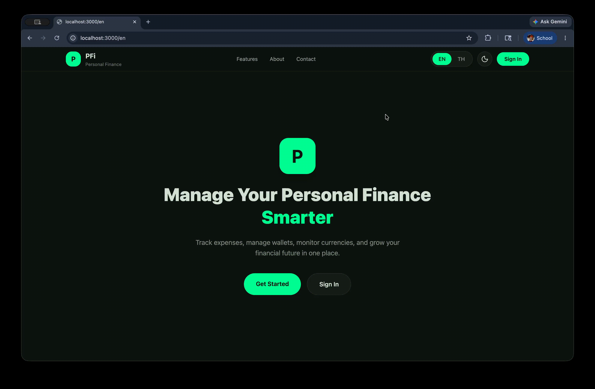
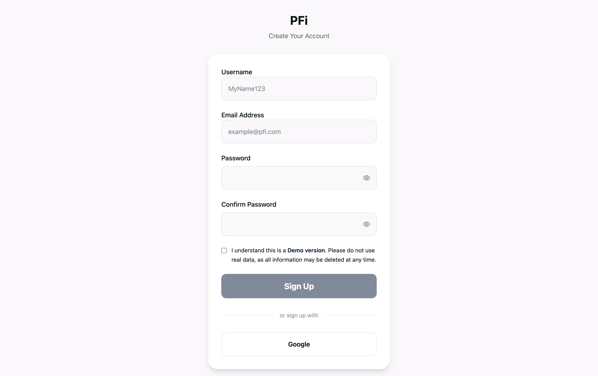
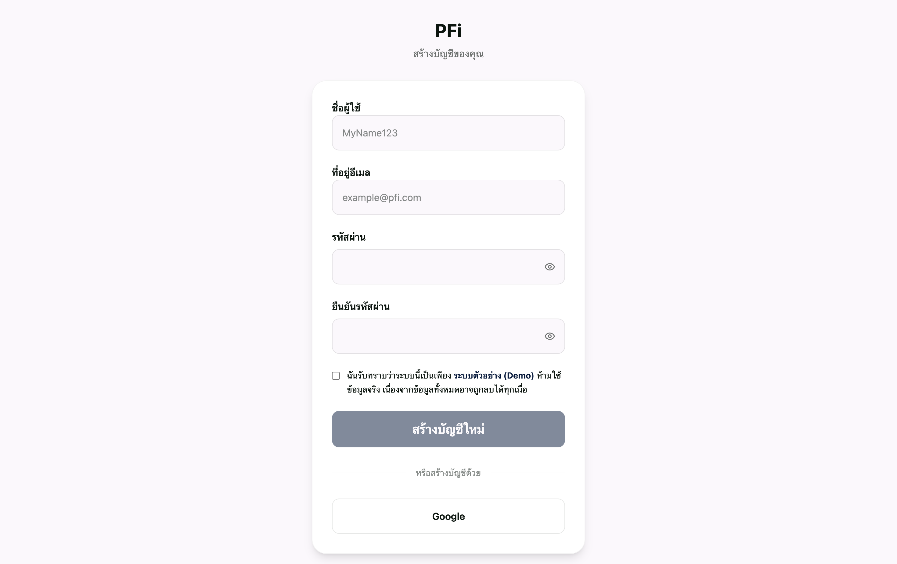
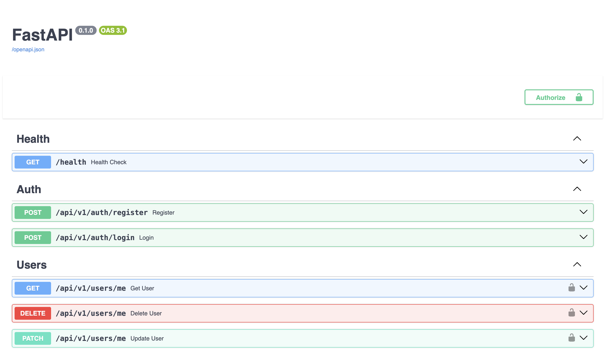
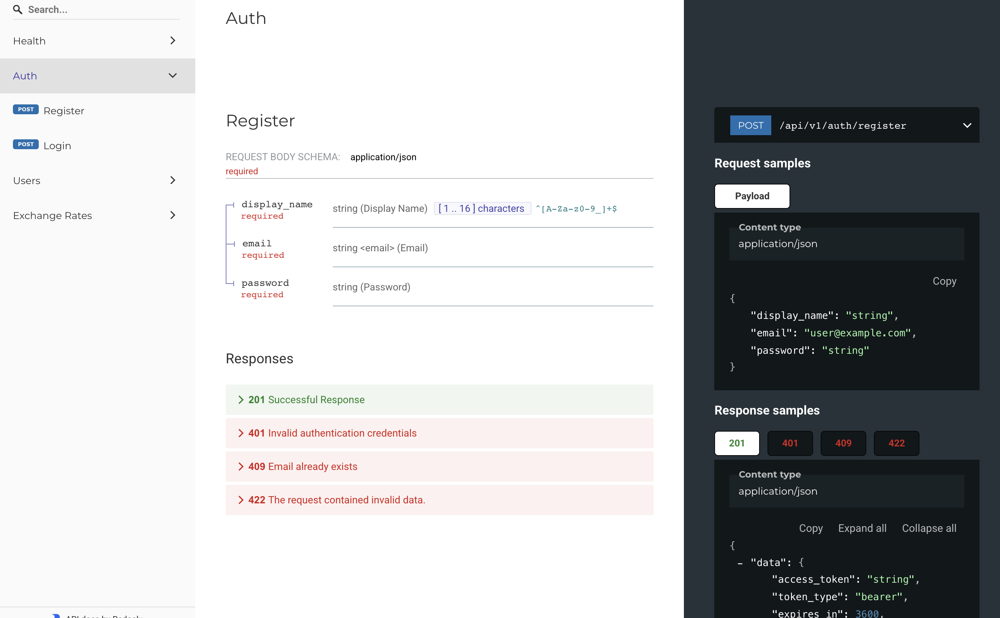

# PFi - Personal Finance Tracker

Personal Finance Tracker application built with FastAPI backend and Next.js frontend.

**Live Demo:** https://pfi-demo.duckdns.org

---

## Preview

### Theme And Language Switching



### Registration Page

| English                                        | Thai                                           |
| ---------------------------------------------- | ---------------------------------------------- |
|  |  |

### Swagger and Redoc

| Swagger                                  | Redoc                                |
| ---------------------------------------- | ------------------------------------ |
|  |  |

---

## Features

- JWT Authentication
- User Management
- Dockerized Testing Environment
- CI/CD Pipeline
- Multi-language Support (English / Thai)
- Light / Dark Theme

## Tech Stack

### Backend

- FastAPI
- PostgreSQL
- SQLModel

### Frontend

- Next.js
- Tailwind CSS v4.0
- TypeScript

## Monorepo Structure

```txt
PFi/
├── apps/
│   ├── api/          # FastAPI backend
│   └── web/          # Next.js frontend
├── docs/             # Documentation
├── infra/            # Infrastructure configs
└── Makefile          # Docker build commands
```

## Local Development

The project consists of 3 main services:

- Backend API (`apps/api`)
- Frontend Web (`apps/web`)
- PostgreSQL Database

You can either:

- Run each service individually for local development
- Or run the full stack using Docker Compose

Please follow the setup instructions in each service README/documentation.

### Services

- Backend API → [Backend API README](apps/api/README.md)
- Frontend Web → [Frontend Web README](apps/web/README.md)
- PostgreSQL → https://www.postgresql.org/docs/

---

## Docker Environment Setup

This project uses environment files based on the selected environment.

The `Makefile` sets the environment automatically:

```bash
# Local development
make dev

# Production
make prod
```

Which internally runs:

```bash
ENVIRONMENT=local docker compose up --build
```

and:

```bash
ENVIRONMENT=production docker compose up -d
```

Docker Compose will automatically load environment files based on the `ENVIRONMENT` variable.

For local development, create these files first:

```bash
# PostgreSQL
cp infra/postgres/.env.example infra/postgres/.env.local

# Redis
cp infra/redis/.env.example infra/redis/.env.local

# Backend API
cp apps/api/.env.example apps/api/.env.local

# Frontend Web
cp apps/web/.env.example apps/web/.env.local
```

The following files will then be loaded automatically:

- `infra/postgres/.env.local`
- `infra/redis/.env.local`
- `apps/api/.env.local`
- `apps/web/.env.local`

## Docker Development

```bash
# Run project
make dev
```

## Testing

```bash
# Run all tests
make test
```

## Project Documentation

- [Backend API README](apps/api/README.md) - API architecture and setup
- [API Auth Flow](docs/api/auth-flow.md) - Authentication flow diagrams
- [API Response Schema](docs/api/response-schema.md) - Standard response formats
- [Architecture](docs/architecture.md) - System design and patterns

## CI/CD

Tests run on every push via GitHub Actions. See `.github/workflows/` for details.
