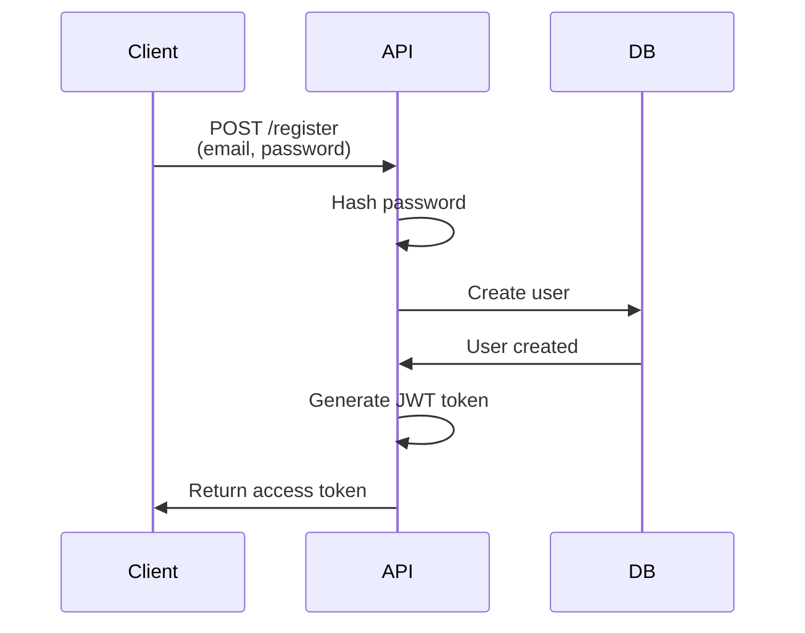
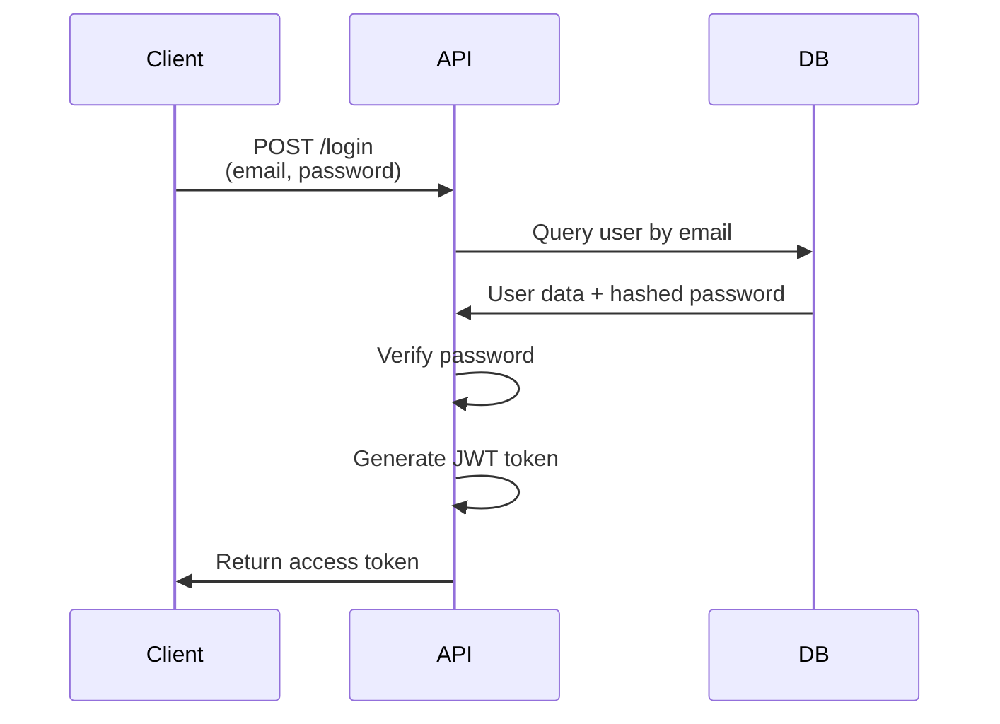
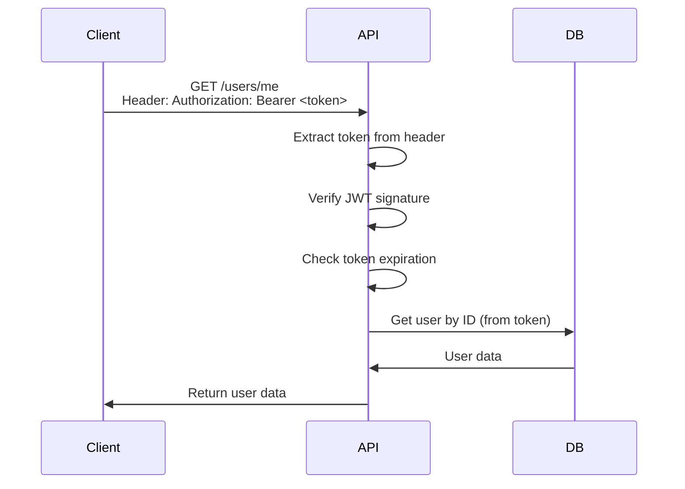

# Authentication Flow

JWT-based authentication for PFi API.

## Registration Flow

```
POST /api/v1/auth/register
{
  "email": "user@example.com",
  "password": "securepass123"
}

Response:
{
  "success": true,
  "message": "User registered successfully",
  "data": {
    "access_token": "eyJ...",
    "token_type": "bearer"
  }
}
```

### Flow Diagram



## Login Flow

```
POST /api/v1/auth/login
{
  "email": "user@example.com",
  "password": "securepass123"
}

Response:
{
  "success": true,
  "message": "Login successful",
  "data": {
    "access_token": "eyJ...",
    "token_type": "bearer"
  }
}
```

### Flow Diagram



## JWT Token Structure

```
Header: {
  "alg": "HS256",
  "typ": "JWT"
}

Payload: {
  "sub": "user-id",
  "exp": 1234567890,
  "iat": 1234567000
}

Signature: HMACSHA256(header.payload, secret_key)
```

## Protected Route Access

```
GET /api/v1/users/me
Headers: Authorization: Bearer <token>

Response:
{
  "success": true,
  "data": {
    "id": "user-id",
    "email": "user@example.com"
  }
}
```

### Flow Diagram



## Token Refresh (Optional)

For long-lived sessions, implement refresh token flow:

```
POST /api/v1/auth/refresh
Headers: Authorization: Bearer <refresh_token>

Response:
{
  "success": true,
  "data": {
    "access_token": "new-token",
    "token_type": "bearer"
  }
}
```

## Error Scenarios

### Invalid Credentials

```json
{
  "success": false,
  "message": "Invalid email or password",
  "error": {
    "code": "INVALID_CREDENTIALS"
  }
}
```

### Email Already Exists

```json
{
  "success": false,
  "message": "User with this email already exists",
  "error": {
    "code": "EMAIL_ALREADY_EXISTS"
  }
}
```

### Invalid/Expired Token

```json
{
  "success": false,
  "message": "user not found",
  "error": {
    "code": "USER_NOT_FOUND"
  }
}
```

## Security

- Passwords hashed with bcrypt
- JWT signed with HS256
- Tokens expire after configurable duration
- CORS enabled for trusted origins
