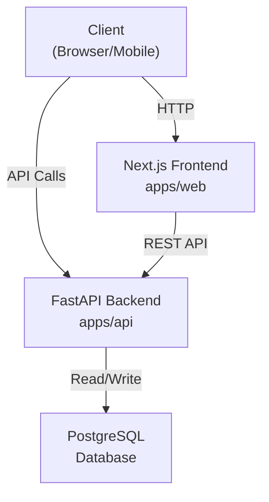
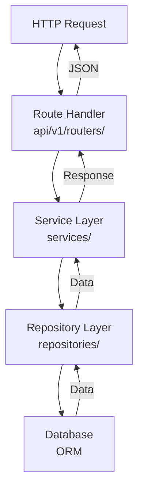
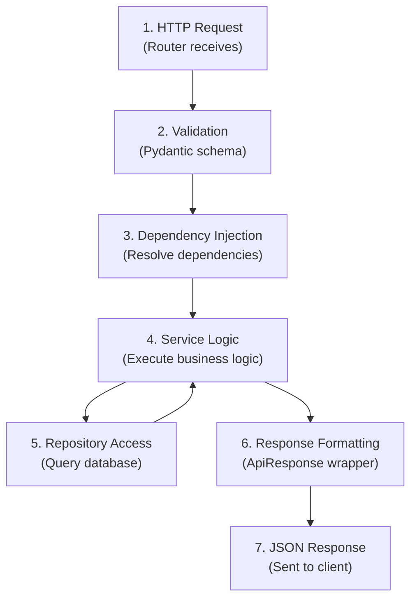
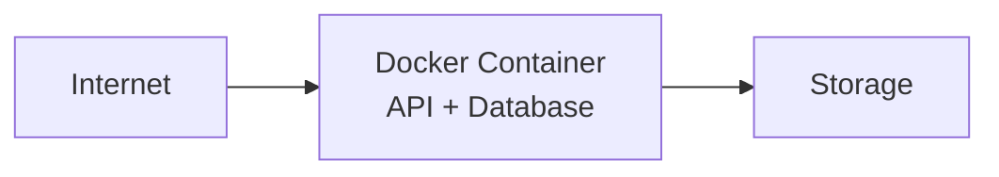

# System Architecture

High-level overview of PFi's architecture and design patterns.

## System Diagram



## Backend Architecture



## Layer Responsibilities

### Router/Handler Layer

- HTTP request handling
- Input validation
- Response formatting
- Route mapping

**Files:** `api/v1/routers/`

### Service Layer

- Business logic
- Validation rules
- Orchestration
- Exception handling

**Files:** `services/`

### Repository Layer

- Database queries
- Data access patterns
- Query optimization
- Transaction management

**Files:** `repositories/`

### Model Layer

- ORM definitions
- Database schema
- Type definitions

**Files:** `models/`

### Schema Layer

- Request validation (Pydantic)
- Response formatting
- Type checking

**Files:** `schemas/`

## Design Patterns

### Repository Pattern

Abstracts database access behind a consistent interface.

```python
# Usage in Service
class UserService:
    def __init__(self, repo: UserRepository):
        self.repo = repo

    def get_user(self, user_id: str):
        return self.repo.get_by_id(user_id)
```

Benefits:

- Easy to test (mock repositories)
- Database-agnostic
- Consistent query interface

### Service Layer Pattern

Encapsulates business logic separate from handlers.

```python
# Handler calls service
@router.post("/users")
def create_user(schema: UserCreate, service: UserService):
    return service.create(schema)
```

Benefits:

- Reusable business logic
- Easier testing
- Clear separation of concerns

### Unit of Work Pattern

Manages database transactions and ensures consistency.

```python
# Transaction management
async with unit_of_work:
    user_repo = unit_of_work.users
    user = user_repo.create(data)
    # Auto-commit on exit
```

### Dependency Injection

FastAPI's dependency injection system (`deps.py`):

```python
# Automatic dependency resolution
def get_user_service() -> UserService:
    return UserService(repo=get_user_repo())

@router.post("/users")
def create_user(service: UserService = Depends(get_user_service)):
    pass
```

## Request Lifecycle



## Error Handling

Custom exception hierarchy in `exceptions/`:

- `AppException` - Base exception
- `AuthException` - Authentication errors
- `UserException` - User-related errors

Exception handlers convert to standardized `ApiResponse`:

## Database Schema

PostgreSQL tables correspond to models:

- `users` - User accounts
- `tokens` (optional) - Token blacklist
- Future: `transactions`, `budgets`, `categories`

## Security Architecture

- **Authentication** - JWT tokens (HS256)
- **Hashing** - bcrypt for passwords
- **CORS** - Configured for frontend origin
- **Environment** - Secrets in `.env` (not in repo)

## Deployment Architecture



Deployment via Docker Compose with:

- API service (FastAPI)
- Database service (PostgreSQL)
- Optional: Web service (Next.js)
- Networking: Internal Docker network
